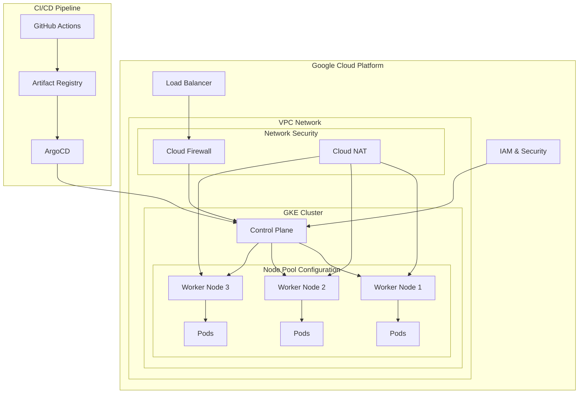
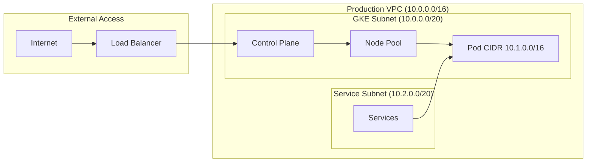
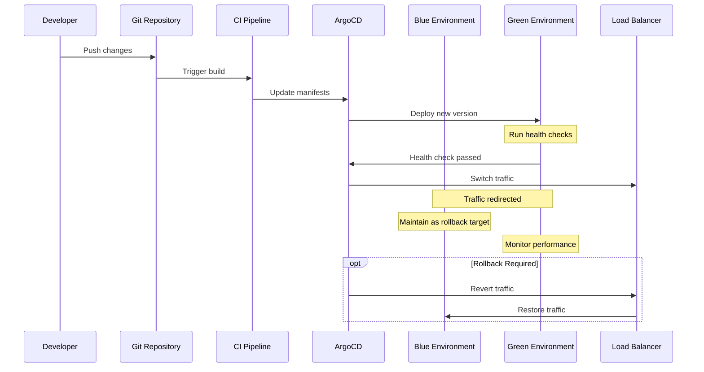
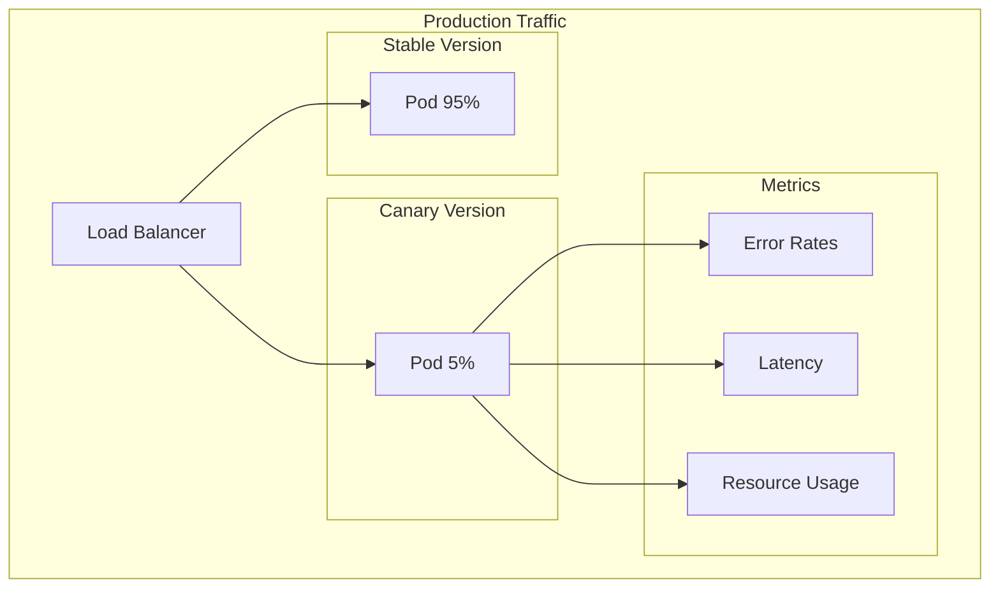
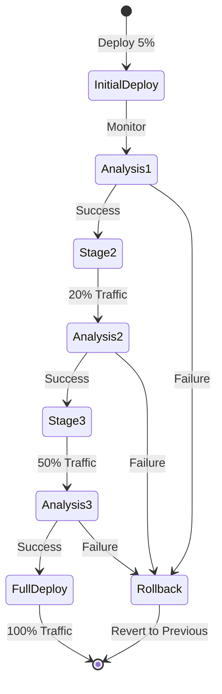
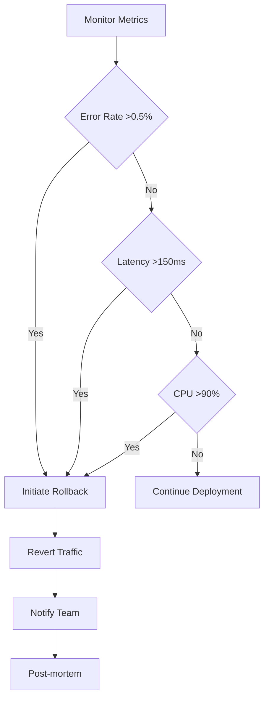
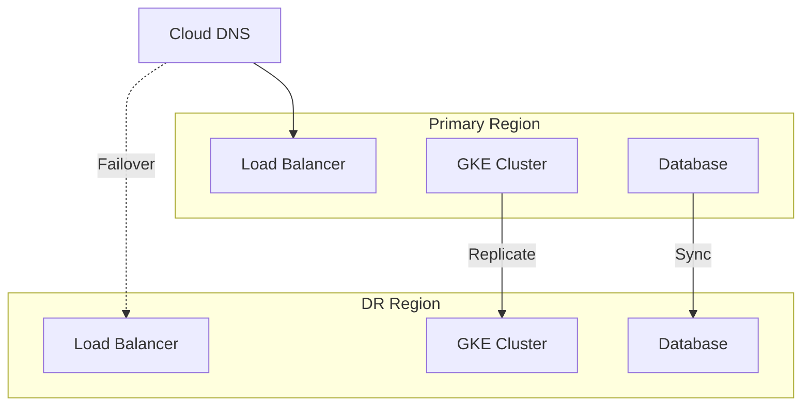
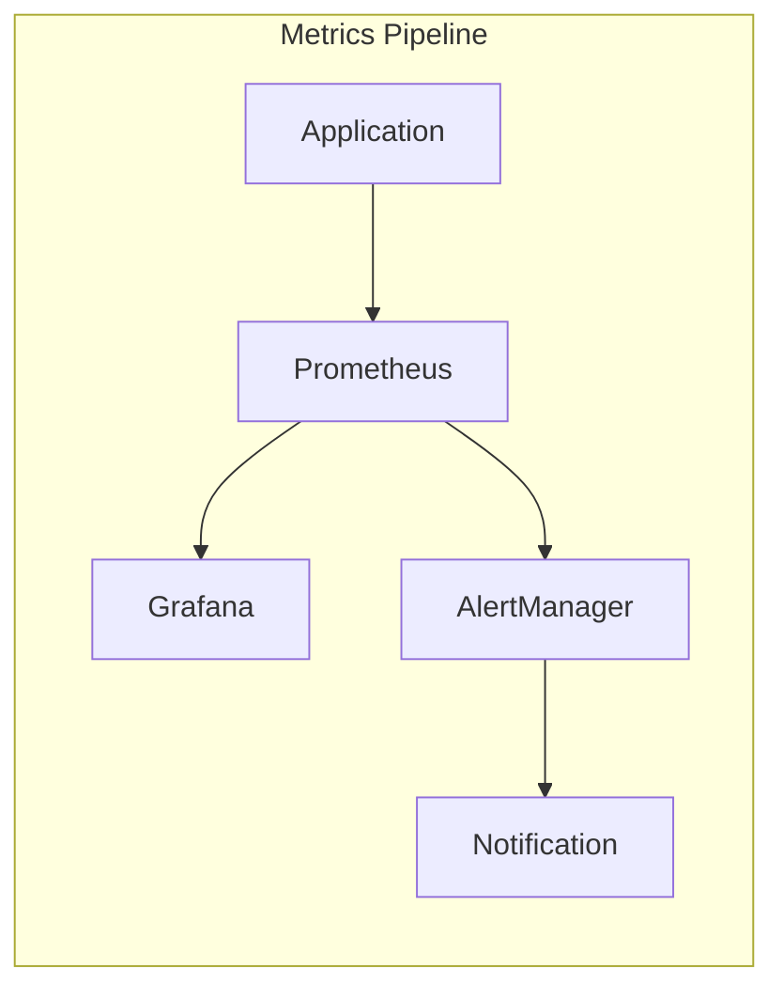

# Enterprise GKE Platform Solutions Architecture Document

## Document Control
- Version: 2.0.0
- Last Updated: January 27, 2025
- Status: Approved
- Authors: Platform Architecture Team

## Table of Contents
1. Executive Summary
2. Business Context
3. Solution Overview
4. Technical Architecture
5. Deployment Strategy
6. Security Architecture
7. Cost Analysis and Optimization
8. Risk Management
9. Success Metrics and KPIs
10. Documentation and Resources
11. Contributing Guidelines
12. Code Standards
13. Appendices

## 1. Executive Summary
This document outlines the comprehensive architecture for an enterprise-grade Google Kubernetes Engine (GKE) platform designed to support a global e-commerce operation. The solution integrates Terraform for infrastructure provisioning, Dataplane V2 for advanced networking, and GitOps principles for automated deployments.

### Key Deliverables
- Fully automated cloud infrastructure
- Multi-region Kubernetes platform
- Integrated security controls
- Automated deployment pipelines
- Comprehensive monitoring solution
- Disaster recovery capabilities

## 2. Business Context

### 2.1 Business Overview
Our enterprise client requires a modern, scalable platform to:
- Support microservices-based architecture
- Handle 10x traffic during peak seasons
- Maintain 99.99% uptime
- Comply with PCI-DSS, GDPR, and SOC2
- Enable rapid global deployments
- Reduce operational costs

### 2.2 Current Challenges
1. Scalability Issues
   - Manual scaling procedures
   - Performance degradation
   - Limited elastic capacity

2. Operational Inefficiencies
   - Complex deployment processes
   - High maintenance overhead
   - Environment inconsistencies
   - Manual provisioning

3. Security & Compliance
   - Complex compliance requirements
   - Manual security patches
   - Inconsistent access controls
   - Limited audit capabilities

### 2.3 Business Requirements

#### Functional Requirements
1. Platform Capabilities
   - Containerized microservices support
   - Stateful/stateless workload support
   - Multi-language support
   - CI/CD integration

2. Scalability Requirements
   - Auto-scaling capability
   - 100,000+ concurrent users
   - Global load balancing
   - 200ms max latency (99th percentile)

3. Availability Requirements
   - 99.99% uptime
   - Multi-region failover
   - RPO < 5 minutes
   - Zero-downtime deployments

#### Non-Functional Requirements

##### Security Controls Matrix Table

| Control Category | Implementation        | Compliance Mapping |
| ---------------- | --------------------- | ------------------ |
| Access Control   | IAM Roles & RBAC      | SOC 2 CC6.1        |
| Network Security | Dataplane V2 & Cilium | ISO 27001 A.13     |
| Data Protection  | Customer-managed keys | GDPR Art. 32       |
| Monitoring       | Cloud Audit Logs      | PCI DSS 10.1       |
1. Security & Compliance
   - PCI-DSS compliance
   - GDPR compliance
   - SOC2 compliance
   - Automated security controls

2. Performance Requirements
   - 100ms response time (95th percentile)
   - Real-time analytics support
   - Optimized resource usage
   - Predictable scaling

## 3. Solution Overview

### 3.1 Architecture Principles
1. Cloud-Native Design
   - Container-first approach
   - Microservices architecture
   - Automated scaling
   - Self-healing systems

2. Security by Design
   - Zero-trust security model
   - Encrypted data in transit/rest
   - Least privilege access
   - Automated compliance controls

3. Operational Excellence
   - Infrastructure as Code
   - GitOps methodology
   - Automated operations
   - Comprehensive monitoring

### 3.2 Key Components
1. Infrastructure
   - GKE Enterprise Cluster
   - Cloud Load Balancing
   - Cloud Storage
   - Cloud KMS

2. Platform Services
   - Container Registry
   - Logging & Monitoring
   - Secret Management
   - Identity Management

3. Development Tools
   - Terraform
   - ArgoCD
   - GitHub Actions
   - Container Security Tools

## 4. Technical Architecture

### 4.1 Infrastructure Architecture


## Network Diagram

### 4.2 Network Architecture
```yaml
network_config:
  vpc_name: prod-vpc
  subnet_ranges:
    primary: 10.0.0.0/20
    pod: 10.1.0.0/16
    service: 10.2.0.0/20
  security:
    private_cluster: true
    master_authorized_networks: true
    network_policy: true
```

### 4.3 Cluster Configuration
```hcl
resource "google_container_cluster" "primary" {
  name     = "enterprise-cluster"
  location = "us-central1"
  
  network_config {
    network    = google_compute_network.vpc.name
    subnetwork = google_compute_subnetwork.subnet.name
    
    datapath_provider = "ADVANCED_DATAPATH"
    enable_private_nodes = true
    master_ipv4_cidr_block = "172.16.0.0/28"
  }
  
  node_config {
    machine_type = "n2-standard-4"
    disk_size_gb = 100
    
    workload_metadata_config {
      mode = "GKE_METADATA"
    }
  }
}
```


## 5. Deployment Strategy

### 5.1 Detailed Deployment Scenarios

#### 5.1.1 Blue-Green Deployment Workflow


#### 5.1.2 Canary Deployment Flow


#### 5.1.3 Progressive Delivery Stages


### 5.2 Deployment Success Metrics

#### 5.2.1 Key Performance Indicators
| Metric Category | KPI | Target | Alert Threshold |
|----------------|-----|--------|-----------------|
| Deployment Speed | Time to Deploy | <10 minutes | >15 minutes |
| Success Rate | Deployment Success | >99% | <98% |
| Rollback Time | Time to Rollback | <5 minutes | >7 minutes |
| Availability | Service Uptime | 99.99% | <99.95% |
| Error Rate | Error Percentage | <0.1% | >0.5% |
| Latency | P95 Response Time | <100ms | >150ms |

#### 5.2.2 Business Metrics
| Metric | Description | Target |
|--------|-------------|--------|
| User Impact | Active Users Affected | <0.1% |
| Feature Adoption | New Feature Usage | >80% |
| System Load | Resource Utilization | <75% |
| Cost Impact | Deployment Cost | <$100 |

### 5.3 Rollback Procedures

#### 5.3.1 Automated Rollback Triggers


#### 5.3.2 Rollback Process
1. Automatic Rollback
   - Error rate threshold exceeded
   - Latency threshold exceeded
   - Resource utilization threshold exceeded
   - Critical security alert

2. Manual Rollback
   - Business decision
   - Unexpected behavior
   - Customer feedback
   - Performance degradation

3. Post-Rollback Actions
   - Incident report
   - Root cause analysis
   - Metric collection
   - Process improvement

### 5.4 Disaster Recovery Scenarios

#### 5.4.1 DR Architecture


#### 5.4.2 Recovery Procedures
1. Regional Failure
   - Automatic detection
   - DNS failover
   - Traffic rerouting
   - System verification

2. Application Failure
   - Service mesh failover
   - Circuit breaking
   - Load shedding
   - Graceful degradation

3. Data Recovery
   - Point-in-time recovery
   - Data consistency check
   - Schema validation
   - Integrity verification

### 5.5 Monitoring and Validation Framework

#### 5.5.1 Metric Collection


#### 5.5.2 Validation Checklist
1. Pre-Deployment
   - Resource availability
   - Dependencies check
   - Security scan
   - Configuration validation

2. During Deployment
   - Health probes
   - Performance metrics
   - Error rates
   - Resource usage

3. Post-Deployment
   - Service availability
   - Feature functionality
   - Integration status
   - Business metrics

## 6. Security Architecture

### 6.1 Security Controls Matrix

| Control Category | Implementation        | Compliance Mapping |
| ---------------- | --------------------- | ------------------ |
| Access Control   | IAM Roles & RBAC      | SOC 2 CC6.1        |
| Network Security | Dataplane V2 & Cilium | ISO 27001 A.13     |
| Data Protection  | Customer-managed keys | GDPR Art. 32       |
| Monitoring       | Cloud Audit Logs      | PCI DSS 10.1       |

### 6.2 Security Best Practices
1. Node Hardening
```yaml
node_config:
  secure_boot: true
  integrity_monitoring: true
  enable_shielded_nodes: true
```

2. Network Policies
```yaml
apiVersion: networking.k8s.io/v1
kind: NetworkPolicy
metadata:
  name: default-deny-all
spec:
  podSelector: {}
  policyTypes:
  - Ingress
  - Egress


### 6.1 Monitoring Setup

#### Prometheus Configuration
```yaml
prometheus:
  global:
    scrape_interval: 15s
  scrape_configs:
    - job_name: 'kubernetes-nodes'
      kubernetes_sd_configs:
        - role: node
```

#### Alert Rules
```yaml
groups:
- name: node-alerts
  rules:
  - alert: HighCPUUsage
    expr: instance:node_cpu_utilisation:rate5m > 0.8
    for: 5m
    labels:
      severity: warning
    annotations:
      description: "CPU usage above 80% for 5 minutes"
```

### 6.2 Backup Procedures

1. Cluster Backup
```bash
# Velero backup
velero backup create daily-backup \
  --include-namespaces=* \
  --exclude-namespaces=kube-system \
  --wait
```

2. State Backup
```hcl
# Terraform state backup
terraform {
  backend "gcs" {
    bucket = "terraform-state"
    prefix = "gke-enterprise"
  }
}
```


## 7. Cost Analysis and Optimization

### 7.1 Component Cost Breakdown

| Component | Monthly Cost | Optimization Potential |
|-----------|--------------|----------------------|
| GKE Control Plane | $73.00 | N/A |
| Node Pools | $876.00 | Spot instances |
| Network Egress | $150.00 | CDN usage |
| Storage | $200.00 | Storage class optimization |

### 7.2 Cost Optimization Strategies

1. Workload Optimization
```yaml
# HorizontalPodAutoscaler configuration
apiVersion: autoscaling/v2
kind: HorizontalPodAutoscaler
metadata:
  name: workload-hpa
spec:
  scaleTargetRef:
    apiVersion: apps/v1
    kind: Deployment
    name: workload
  minReplicas: 1
  maxReplicas: 10
  metrics:
  - type: Resource
    resource:
      name: cpu
      target:
        type: Utilization
        averageUtilization: 70
```

## 8. Risk Management

### 8.1 Risk Assessment Matrix

| Risk | Impact | Probability | Mitigation |
|------|---------|------------|------------|
| Control plane failure | High | Low | Regional cluster setup |
| Network partition | High | Medium | Redundant connectivity |
| Data loss | Critical | Low | Regular backups |
| Security breach | Critical | Low | Defense in depth |

### 8.2 Contingency Plans

1. Control Plane Failure
```bash
# Failover procedure
gcloud container clusters update enterprise-cluster \
  --zone fallback-zone \
  --maintenance-window-start "03:00" \
  --maintenance-window-end "08:00"
```

## 9. Success Metrics and KPIs

### 9.1 Performance Metrics
- Control plane availability: 99.99%
- API response time: <100ms
- Pod startup time: <30s
- Network latency: <1ms within cluster

### 9.2 Reliability Metrics
- Deployment success rate: >99%
- Backup success rate: 100%
- Recovery time objective (RTO): <15 minutes
- Recovery point objective (RPO): <5 minutes

## 10. Documentation and Resources

### 10.1 Technical Documentation
- [GKE Best Practices](docs/gke-best-practices.md)
- [Network Architecture](docs/network-architecture.md)
- [Security Controls](docs/security-controls.md)
- [Operational Procedures](docs/ops-procedures.md)

### 10.2 Runbooks
- [Incident Response](runbooks/incident-response.md)
- [Backup and Recovery](runbooks/backup-recovery.md)
- [Performance Troubleshooting](runbooks/performance.md)
- [Security Incidents](runbooks/security-incidents.md)

## 11. Contributing Guidelines

### 11.1 Development Workflow
1. Fork the repository
2. Create feature branch
3. Submit pull request
4. Pass CI checks
5. Obtain code review
6. Merge to main

### 11.2 Code Standards
```yaml
# Pre-commit hooks configuration
repos:
  - repo: https://github.com/pre-commit/pre-commit-hooks
    rev: v4.4.0
    hooks:
      - id: trailing-whitespace
      - id: end-of-file-fixer
      - id: check-yaml
      - id: check-added-large-files
```

---

## License
This document and associated code are licensed under the MIT License. See [LICENSE](LICENSE) for details.

## Appendix


## Version History
- v1.0.0 - Initial release
- v1.1.0 - Added security controls matrix
- v1.2.0 - Enhanced monitoring configuration
- v1.3.0 - Added cost optimization strategies