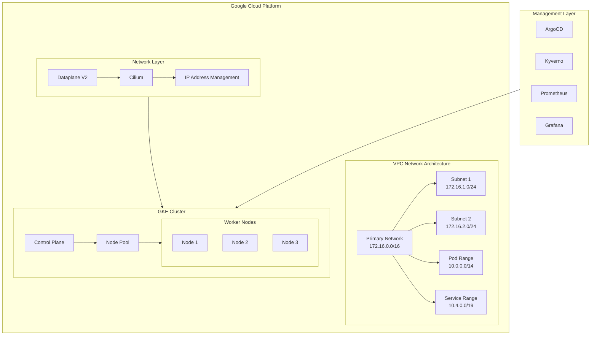
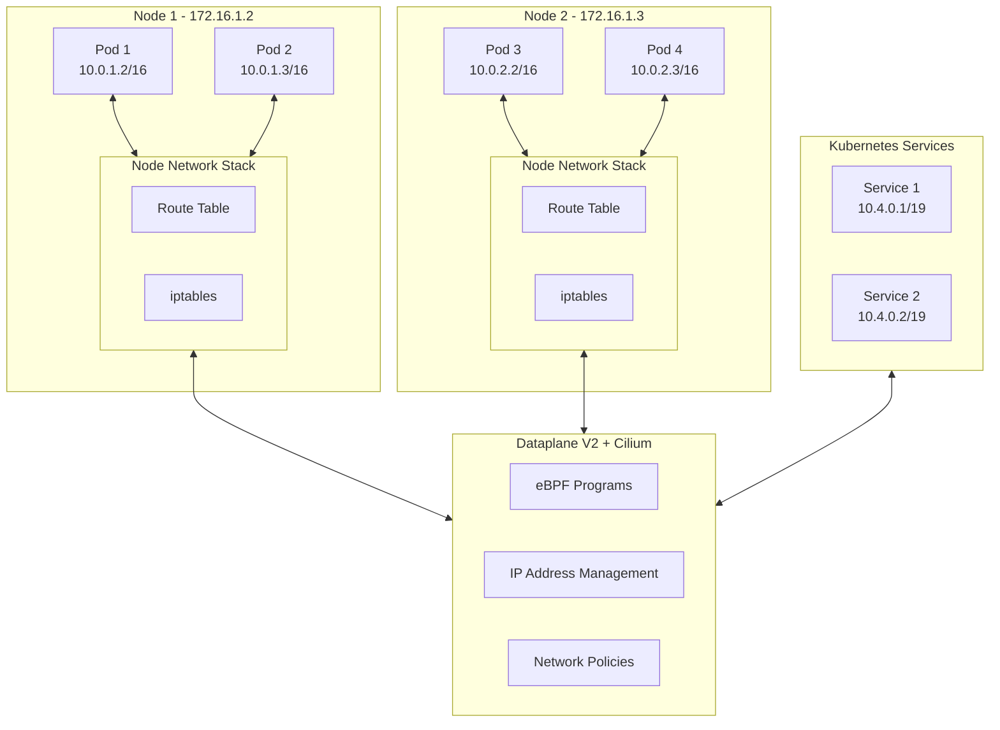
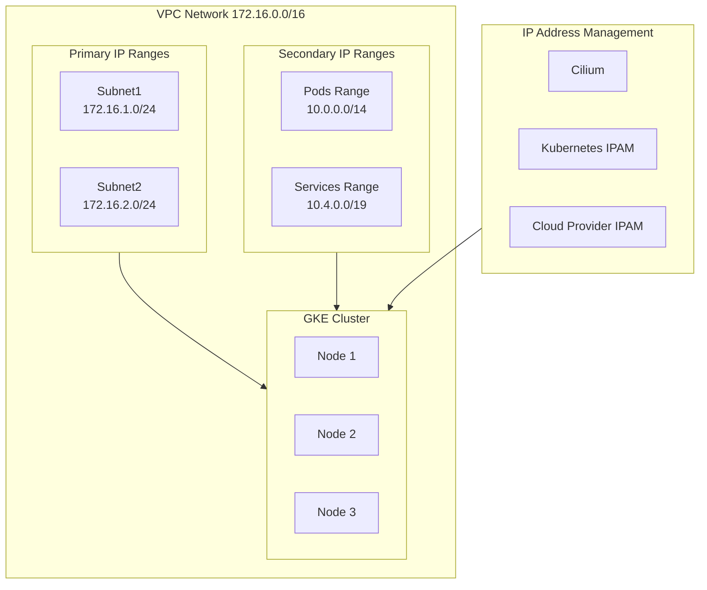
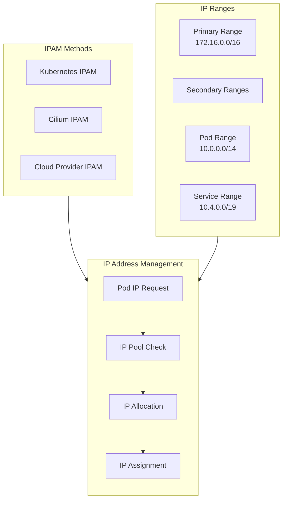
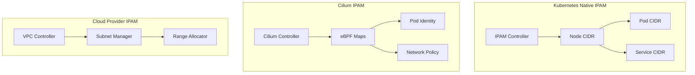
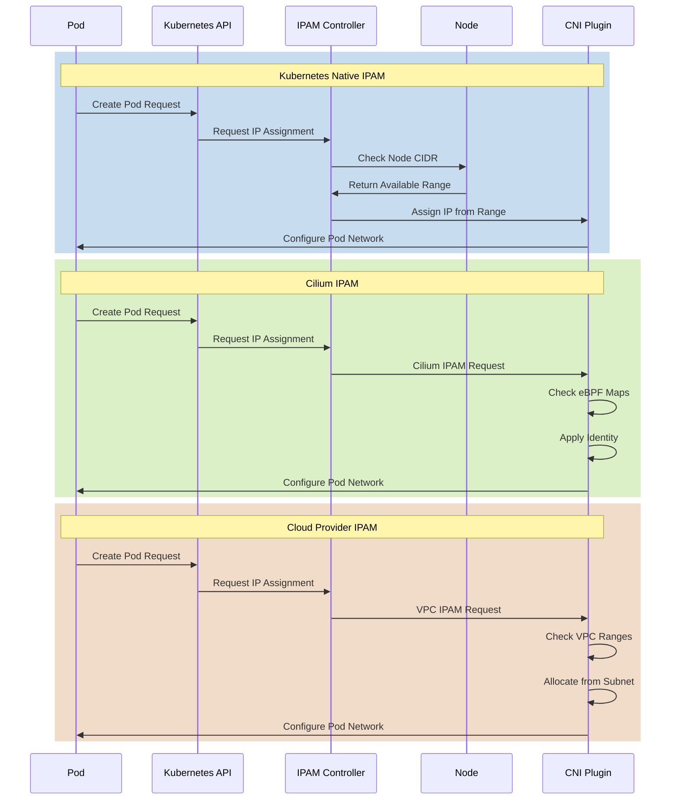

# Technical Documentation: GKE Cluster Setup with Terraform, Dataplane V2, and Automated CI/CD Deployment

## Table of Contents

1. [Introduction](#introduction)
2. [System Architecture](#system-architecture)
3. [Network Architecture](#network-architecture)
4. [IP Address Management](#ip-address-management)
5. [GKE Cluster Configuration](#gke-cluster-configuration)
6. [Network Security and Policies](#network-security-and-policies)
7. [CI/CD Pipeline](#cicd-pipeline)
8. [Monitoring and Observability](#monitoring-and-observability)
9. [Troubleshooting Guide](#troubleshooting-guide)
10. [Contributing](#contributing)
11. [License](#license)

## 1. Introduction

This document provides a comprehensive technical guide for deploying a Google Kubernetes Engine (GKE) cluster using Terraform, configuring advanced networking with Dataplane V2 and Cilium, and implementing automated CI/CD deployment using GitOps principles.

### Key Components
- GKE with Dataplane V2
- Custom VPC with secondary IP ranges
- Cilium for advanced networking
- ArgoCD for GitOps
- Kyverno for policy enforcement
- Prometheus and Grafana for monitoring

## 2. System Architecture

Our system architecture consists of multiple interconnected components within the Google Cloud Platform environment:



### Components Breakdown
1. **VPC Network**
   - Primary Network (172.16.0.0/16)
   - Subnet 1 (172.16.1.0/24)
   - Subnet 2 (172.16.2.0/24)
   - Pod Range (10.0.0.0/14)
   - Service Range (10.4.0.0/19)

2. **GKE Cluster**
   - Control Plane
   - Node Pools
   - Worker Nodes

## 3. Network Architecture

### Network Flow and Communication

The following diagram illustrates the pod-to-pod communication and network flow within our GKE cluster:



### Network Components



## 4. IP Address Management

### IPAM Workflow

The following diagram shows the IP address management workflow:



### IPAM Methods




---





##### 1. Kubernetes Native IPAM

#### Key Features:

- Built into Kubernetes core
- Node-based CIDR allocation
- Integrated with kube-controller-manager

#### How it Works:

1. **Pod IP Allocation**:
    - Each node gets a CIDR range (/24 by default)
    - Node-local IPAM tracks available IPs
    - Sequential allocation within node CIDR
2. **GKE Integration**:
    - Uses secondary IP ranges
    - Automatic node CIDR assignment
    - Integration with VPC networking
3. **Limitations**:
    - Basic IP conflict prevention only
    - Limited scalability for large clusters
    - No advanced networking features
    - Simple allocation strategy

##### 2. Cilium IPAM

#### Key Features:

- eBPF-based IP management
- Identity-aware allocation
- Advanced networking policies

#### How it Works:

1. **IP Allocation Strategy**:
    - Global pool management via eBPF maps
    - Identity-based IP assignment
    - Efficient IP space utilization
2. **Dataplane V2 Integration**:
    - Direct eBPF integration
    - Bypass kube-proxy
    - Optimized packet processing
3. **Advanced Features**:
    - Topology-aware allocation
    - Pre-allocation policies
    - Custom allocation strategies
    - Cross-cluster coordination

##### 3. Cloud Provider IPAM (GCP)

#### Key Features:

- Native VPC integration
- Automated range management
- Cloud-scale networking

#### How it Works:

1. **VPC Integration**:
    - Direct access to VPC CIDR ranges
    - Subnet-aware allocation
    - Automatic range expansion
2. **Range Management**:
    - Dynamic CIDR allocation
    - Automatic subnet creation
    - Range conflict prevention
3. **Automation Features**:
    - Auto-scaling support
    - Cross-region coordination
    - IAM integration

### Best Practices for Each Method

1. **Kubernetes Native IPAM**:
    
    `- Use larger node CIDR ranges (/24 or /23) - Monitor IP exhaustion - Plan for cluster growth`
    
2. **Cilium IPAM**:
    
    `- Enable BPF NodePort - Use pre-allocation when possible - Configure appropriate identity retention - Enable metrics for monitoring`
    
3. **Cloud Provider IPAM**:
    
    `- Use auto-mode VPC networks - Plan IP ranges for growth - Enable flow logs - Use proper IAM permissions`
    

### Choosing the Right IPAM Method

1. **Use Kubernetes Native IPAM when**:
    - Simple cluster requirements
    - Standard networking needs
    - Limited policy requirements
2. **Use Cilium IPAM when**:
    - Advanced security needed
    - High-performance requirements
    - Complex networking policies
    - Service mesh integration
3. **Use Cloud Provider IPAM when**:
    - Deep cloud integration needed
    - Auto-scaling is priority
    - Multi-cluster deployments
    - Cloud-native architecture
### IP Allocation Process

1. Pod creation triggers IP request
2. IPAM controller checks available IP pools
3. IP assigned from appropriate secondary range
4. Cilium configures network connectivity

## 5. GKE Cluster Configuration

### Cluster Architecture

- Control plane configuration
- Node pool settings
- Networking stack integration

### Node Configuration

- Machine types and sizing
- Node labels and taints
- Auto-scaling configuration

### Network Configuration

- Dataplane V2 setup
- Cilium integration
- Service mesh configuration

## 6. Network Security and Policies

### Network Policies

- Pod-level security
- Namespace isolation
- Service access control

### Security Groups

- Node-level security
- Control plane access
- External access controls

### Cilium Network Policies

- L3/L4/L7 policies
- Custom network rules
- Policy enforcement

## 7. CI/CD Pipeline

### Pipeline Components

- GitHub Actions workflows
- ArgoCD configuration
- Image build and push process

### GitOps Workflow

- Repository structure
- Deployment strategies
- Rollback procedures

## 8. Monitoring and Observability

### Monitoring Stack

- Prometheus deployment
- Grafana dashboards
- Alert configuration

### Network Monitoring

- Cilium network visibility
- Traffic flow monitoring
- Performance metrics

## 9. Troubleshooting Guide

### Common Issues

- Network connectivity problems
- IP allocation failures
- Policy enforcement issues

### Debugging Tools

- Cilium debugger
- Network diagnostics
- Log analysis

## 10. Contributing

We welcome contributions! Please follow these steps:

1. Fork the repository
2. Create a feature branch
3. Submit a pull request

## 11. License

This project is licensed under the MIT License. See the LICENSE file for details.

## Appendix A: IP Range Planning

### Subnet Allocation
- Development: 172.16.1.0/24
- Staging: 172.16.2.0/24
- Production: 172.16.3.0/24

### Pod IP Allocation
- Dev Pods: 10.0.0.0/15
- Prod Pods: 10.2.0.0/15

### Service IP Allocation
- Dev Services: 10.4.0.0/20
- Prod Services: 10.4.16.0/20

## Appendix B: Performance Optimization

### Network Performance
- MTU optimization
- TCP keepalive settings
- Load balancing configuration

### Resource Allocation
- CPU and memory limits
- Network bandwidth allocation
- Storage configuration

## Appendix C: Networking Quick Reference

### Required Ports
- TCP 443: Kubernetes API server
- TCP 10250: Kubelet API
- TCP 15000/15001: Cilium proxy
- UDP 8472: VXLAN overlay
- TCP 2379-2380: etcd client & peer

### Network Policies
Example base network policy template:
```yaml
apiVersion: cilium.io/v2
kind: CiliumNetworkPolicy
metadata:
  name: basic-ingress
spec:
  endpointSelector:
    matchLabels:
      app: myapp
  ingress:
  - fromEndpoints:
    - matchLabels:
        io.kubernetes.pod.namespace: myapp
```