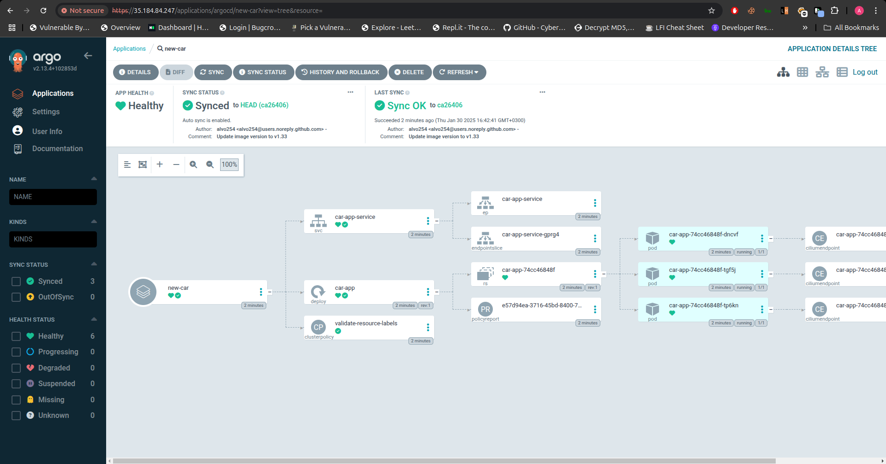
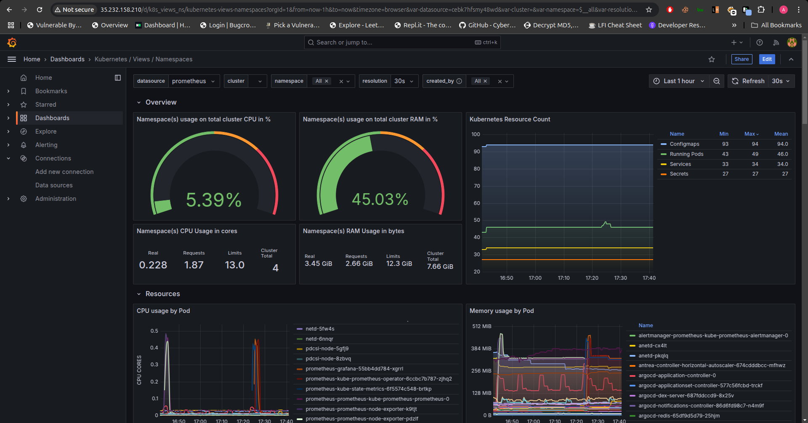
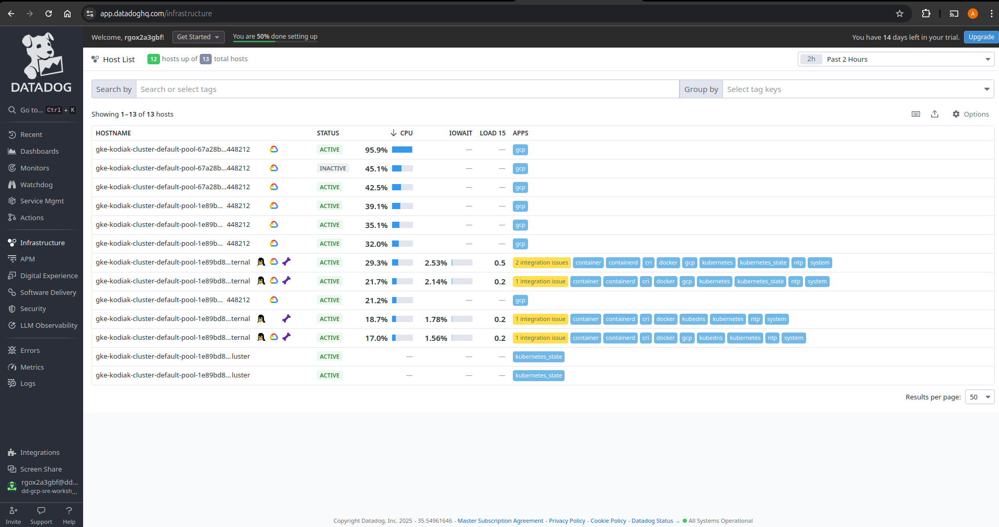
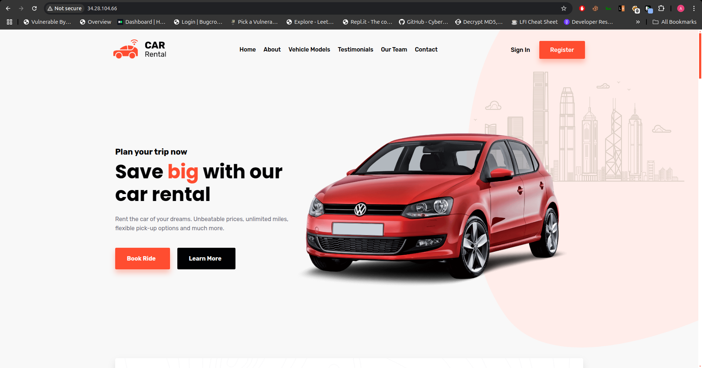

# kodiak







## Automated CI/CD Deployment with Kubernetes and GitOps

## Table of Contents

- [Project Overview](#project-overview)
- [Project Details](#project-details)
- [Project Structure](#project-structure)
- [Pre-Requisites](#pre-requisites)
- [Getting Started](#getting-started)
    - [Cloning the Repositories](#cloning-the-repositories)
    - [CI/CD Workflow](#cicd-workflow)
    - [ArgoCD Deployment](#argocd-deployment)
- [Documentation](#documentation)
- [Troubleshooting](#troubleshooting)
- [Contributing](#contributing)
- [License](#license)

---

## Project Overview

This project demonstrates a GitOps-based CI/CD pipeline for deploying a containerized application to Kubernetes, leveraging **Docker**, **Terraform**, **Cilium**, **Kyverno**, **GitHub Actions**, and **ArgoCD** to automate the building, versioning, infrastructure provisioning, network security, policy enforcement, and deployment of applications. **Terraform** is used to provision necessary infrastructure, such as the Kubernetes cluster and cloud resources, while **Docker** containerizes the application and pushes it to a container registry. **GitHub Actions** automates the CI/CD workflow for building and pushing Docker images, and **ArgoCD** manages the GitOps-based deployment by syncing the state in the `kodiak` repository with the live cluster. **Cilium** provides network security, load balancing, and observability with eBPF-based networking and security policies, and **Kyverno** enforces security and best practices in the Kubernetes environment through policies that validate, mutate, and generate resources.

It is divided into two repositories:

- **`kodi`**: Contains the application source code and Docker build pipeline.
- **`kodiak`**: Contains Kubernetes manifests and GitOps configurations for deployment.

---

## Project Details

**Name:** Kubernetes CI/CD Deployment  
**Description:** A GitOps-based workflow to build Docker images, push them to a container registry, and deploy the application to a Kubernetes cluster using ArgoCD.  
**Key Components:**

- **Docker**: Containerization of the application.
- **GitHub Actions**: CI/CD automation tool for building and pushing Docker images.
- **Kubernetes**: Orchestrates containerized applications.
- **ArgoCD**: GitOps tool for managing Kubernetes deployments.
- **GitOps**: Workflow to ensure Kubernetes manifests in Git match the live cluster.

**Purpose:** Streamline application updates and deployments with minimal manual intervention.

---

## Project Structure

### `kodi` Repository

```
kodi/
├── README.md
├── Dockerfile
├── .dockerignore
├── docker-compose.yml
├── package/
│   ├── manifests/
│   │   ├── frontend.yaml
│   │   └── validate-resources.yaml
├── frontend/
│   ├── public/
│   ├── src/
│   │   ├── components/
│   │   ├── images/
│   │   ├── pages/
│   │   ├── styles/
│   │   └── App.js
│   ├── package.json
│   ├── package-lock.json


```


### `kodiak` Repository

```
kodiak/
├── .git/                          # Git version control metadata
├── .terraform/                    # Terraform configuration and provider files
│   ├── modules/                   # Terraform modules
│   └── providers/                 # Provider plugins
├── Docs/                          # Documentation files
│   ├── SAD.md                     # System Architecture Document
│   └── Technical-doc.md           # Technical documentation
├── modules/                       # Custom Terraform modules
│   ├── vpc/                       # VPC-related Terraform module
│   │   ├── main.tf                # Main module logic
│   │   ├── variables.tf           # Input variables
│   │   └── outputs.tf             # Output definitions
│   ├── gke/                       # GKE-related Terraform module
│       ├── main.tf                # Main module logic
│       ├── variables.tf           # Input variables
│       └── outputs.tf             # Output definitions
├── main.tf                        # Main Terraform configuration file
├── providers.tf                   # Terraform provider configurations
├── terraform.tfstate              # Current Terraform state
├── terraform.tfstate.backup       # Backup of the Terraform state
├── .terraform.lock.hcl            # Terraform dependency lock file
├── .gitignore                     # Git ignore file
└── README.md                      # Project README file

```

---

## Pre-Requisites

Before setting up the pipeline, ensure the following tools are installed:

- **Docker**: For building container images.
- **Kubectl**: Command-line tool for interacting with Kubernetes clusters.
- **Helm**: Package manager for Kubernetes applications.
- **ArgoCD**: For GitOps-based deployment management.
- **GitHub Actions**: CI/CD tool for automating workflows.
- **Terraform**: 
- **Cilium**

---

## Getting Started

### Cloning the Repositories

Clone both repositories to your local machine:

`# Clone the application repository git clone https://github.com/alvo254/kodi.git  # Clone the GitOps repository git clone https://github.com/alvo254/kodiak.git`

### CI/CD Workflow (kodi Repository)

This repository is not for you to run and build using docker build it possible for development but I intend for this to be the source application in context to argocd. So basically my argo app.

The CI/CD pipeline in the `kodi` repository:

1. **Builds the Docker image.**
2. **Pushes the image to a container registry.**
3. **Updates the `kodiak` repository with the new image version.**


---


### How to Run (kodiak Repository)

To run the `kodiak` repository, follow these steps:

#### **Step 1: Provision Infrastructure with Terraform**

Before deploying any applications, you need to provision the necessary infrastructure using Terraform. This step sets up your Kubernetes cluster and other required resources.

- **Initialize Terraform:**
    
    `terraform init    # Initialize the Terraform working directory`
    
- **Review the Changes:**
    
    `terraform plan    # Review the changes Terraform will apply`
    
- **Apply the Terraform Configuration:**
    
    `terraform apply   # Apply the configuration to provision the infrastructure`
    

This step will create the necessary infrastructure, and once complete, you're ready to move forward.

---

#### **Step 2: Verify the Deployment**

After Terraform has successfully provisioned the infrastructure, verify that everything is in place by checking the status of your resources.

- **Check the status of the deployed resources:**

```
kubectl get pods -A         # List all pods
kubectl get services -A     # List all services
kubectl get deployments -A  # List all deployments

```

These are some commands that will help ensure that your resources are properly deployed and running in the Kubernetes cluster.

---

## Advanced Configurations

### Using Cilium with GKE Dataplane V2

Cilium is integrated into GKE Dataplane V2 to enhance networking and security. It provides advanced features like eBPF-based observability and network policies.

#### Steps to Enable GKE Dataplane V2

1. Ensure your GKE cluster is created with Dataplane V2 enabled. You can specify this during cluster creation using the following Terraform snippet:
    

```
resource "google_container_cluster" "primary" {
  name       = "example-cluster"
  location   = "us-central1"

  datapath_provider = "ADVANCED_DATAPATH"
}
```


### Implementing Kyverno for Policy Enforcement

Kyverno is used for policy management, ensuring compliance and governance in your Kubernetes cluster. It automates validations, mutations, and generation of Kubernetes resources.

#### Install Kyverno

1. Add the Kyverno Helm repository:
    
    `helm repo add kyverno https://kyverno.github.io/kyverno/`
    
2. Install Kyverno:
    
    `helm install kyverno kyverno/kyverno -n kyverno --create-namespace`
    

## Documentation

- **Cilium Documentation**: [Docs/cilium.md](https://github.com/alvo254/ekscape/blob/main/Docs/cilium.md)
- **Technical Documentation**: Docs/technical-docs.md
- **Solution Architect Documentation**: [Docs/sad.md](https://github.com/alvo254/ekscape/blob/main/Docs/sad.md)

## Troubleshooting

1. **ArgoCD Sync Errors**: Ensure the `kodiak` repository is configured correctly in ArgoCD.
2. **Docker Image Push Errors**: Verify DockerHub credentials in GitHub Secrets.
3. **Kubernetes Deployment Issues**: Confirm the image tag matches the pushed Docker image version.

---

## **Contributing**

We welcome contributions to improve the repository. Follow these steps:

1. Fork the repository.
    
2. Create a new branch:
    
    ```
    git checkout -b feature/YourFeature
    ```
    
3. Commit your changes:
    
    ```
    git commit -m 'Add YourFeature'
    ```
    
4. Push your changes:
    
    ```
    git push origin feature/YourFeature
    ```
    
5. Open a Pull Request.

---

## License

This project is licensed under the MIT License. See the LICENSE file for details.
